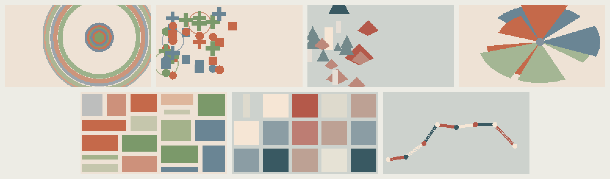

# Rill Mallet

A sampled sibling to [Rill](../rill). Same composer, different voice: instead of
synthesizing each note, it plays multisampled tuned percussion. Seven
instruments, one per generation: balafon, glockenspiel, kalimba, marimba,
piano, vibraphone and xylophone.

## Why samples

Rill's seven timbres are built per sample on the device, which caps how complex
a single note can be. A recorded or offline-rendered note carries detail no
per-sample budget on this board can afford, and playing it back costs almost
nothing: a read pointer, a resampling ratio and linear interpolation.

The clips live in flash and are read from there a sample at a time. RAM is
unchanged from Rill.

## Multisampling

Five to eight zones per instrument, at pitches it was actually recorded at. A
note picks the nearest zone and resamples from that zone's root, so nothing is
bent more than a few semitones. Stretching one clip across a whole range is
what makes a sampled instrument sound like a cartoon at its edges.

Each instrument also brings its own register. Rill folds its melody into a
fixed MIDI 60–91 because its synthesis can play anything; a glockenspiel has
no low F and a marimba has no top C. The melody takes the top two thirds of
whatever the instrument's recorded range is and the support part the bottom
half, so the two never sit on top of each other.

## The samples

All seven come from the [Versilian Community Sample
Library](https://github.com/sgossner/VCSL), which is CC0 and so carries no
conditions. `tools/fetch_vcsl.py` picks the zones, downloads them, converts to
mono 16-bit at 32 kHz, cuts the room tone each clip opens with, and normalizes
each instrument with a single gain so it keeps its own register balance.

Clip length is per instrument. A xylophone bar is finished inside a second and
a vibraphone is not, and storing silence is storing flash.

```sh
python tools/fetch_vcsl.py build/samples
python tools/embed_samples.py build/samples
```

`tools/render_kalimba.py` synthesizes a set instead — a tine modelled as a bar
clamped at one end, partials near 1 : 6.18 : 17.3 : 33.8 with separate decays,
a filtered strike and a body resonance. It is kept for prototyping an
instrument no free recording exists for. Anything recorded that goes into
`src/Samples.h` needs a license compatible with GPL-3.0; see
[docs/SOURCES.md](docs/SOURCES.md).

`embed_samples.py` takes `<instrument>_<root midi>.wav`, mono 16-bit PCM at
32 kHz, and writes `src/Samples.h`. The root in the filename is the pitch the
clip was made at; get it wrong and the whole zone is detuned.

## Build and install

```sh
python -m pip install -r requirements-dev.txt
pio run
python tools/flash.py --port YOUR_DEVICE_PORT
```

Host audition, without hardware:

```sh
c++ -std=c++17 -O2 tools/render.cpp -o build/render
build/render build/mallet.wav 60 42
```

Arguments are output path, seconds, seed, and optional first family (0–6).

## Flurries

A melody note occasionally breaks into a few very fast repeats, sometimes
alternating with the neighbouring scale tone. The idea is Rill Drums'
thirty-second ratchets, where splitting one step into rapid hits was what let
a pattern change note length rather than only add and remove notes. On a
pitched instrument the same device reads as a roll, or as a trill when it
alternates — and a roll is how these instruments are played in the first
place, so Mallet takes them slightly more often than Rill Synth does.

Each repeat is quieter than the one before, and a flurry is never longer than
the space before the next note: past that it stops being an ornament and
becomes the phrase. Only about half of generations flurry at all, since every
piece doing it would make an ornament into a tic.

## The visuals

Seven characters, drawn independently of the instrument. A new generation
picks a new instrument and a new character separately; a shake picks a
character again without touching the sound. Pairing them one to one turns
seven instruments and seven characters into seven fixed pieces, and the point
of a generative instrument is the combinations it finds.



*Top row: split, spark, ring, trace. Bottom row: fold, bloom, snap.*

- **Split** — every strike cuts the page in two and the new region takes its own flat colour. A composition built note by note.
- **Spark** — small precise marks on an empty page, one per strike, accumulating until the page is full and a new one starts.
- **Ring** — every strike pushes a ring out from the core, and the rings stay until they leave the frame.
- **Trace** — a line that turns a corner on every strike and is drawn to it over the next fraction of a second.
- **Fold** — a grid of cells, one turning on every strike: it shrinks to its edge and comes back in a new colour, with two neighbours following a moment later.
- **Bloom** — petals opening one to a strike, stepping round by the golden angle, until the rosette is full and another starts.
- **Snap** — a strike bursts into shards that scatter from the point and fade. Nothing accumulates.

Every one of them is built out of strikes. The first pass included three that
animated on their own and only nudged when a note arrived — a rotating wheel,
swelling bars, a shifting field — and all three read as dead, because what
was moving had nothing to do with what was playing.

They are drawn in Rill's language — opaque shapes, hard edges, a coloured
ground, no glow or gradient — but driven differently. Rill's families answer a
smoothed output level; these answer individual strikes and the pitch of each
one, which is what a mallet instrument gives you and a level meter throws
away. Pitch is mapped against the register the generation is actually playing
in, so a glockenspiel uses the whole frame rather than its right-hand third.

## Layout

- `src/Mallet.h` — Rill's score with a sampled voice layer
- `src/Samples.h` — generated; roughly 4 MB of multisample zones
- `partitions_mallet.csv` — one factory app partition instead of two OTA slots, for the samples
- `src/Resonance.h` — one visual character per instrument
- `tools/render_kalimba.py` — renders the placeholder set
- `tools/embed_samples.py` — WAV to header

## License

GPL-3.0-or-later, following Rill. See [LICENSE](LICENSE).
